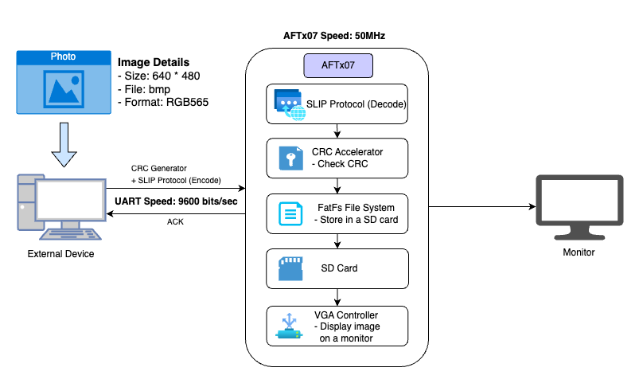
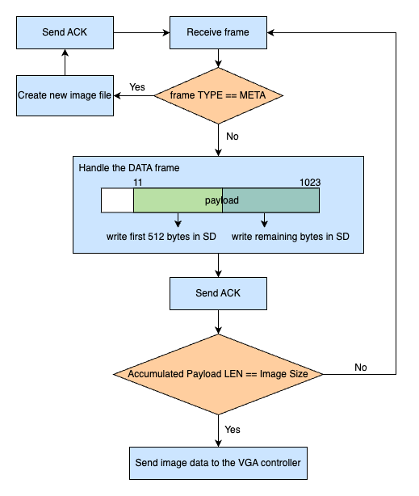
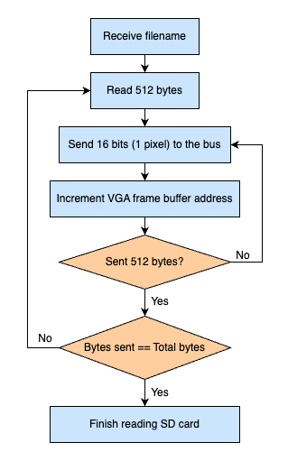

# OS-Development   (Smart Photo Frame with AFTx07)
## Introduction
This project integrates SLIP, FatFs, CRC, and VGA to devlop a Smart Photo Frame that receives images sent from an external device to the AFTx07 and displays them on a monitor in a slideshow format.

## Design Overview

## Image Requirement
|  **Property**  | **Specification** |
|----------------|-------------------|
| Resolution     | 640 x 480         |
| File Format    | BMP               |
| Color Format   | RGB565            |

## Circuit Requirement
### SD and SPI
For SD and SPI setup, please refer to the README in the [fatfs-aft](https://github.com/Purdue-SoCET/fatfs-aft).
### UART
Because the SLIP protocol's sender and receiver must be able to communicate with each other, two FTDIs are required for UART. Please refer to the table below for the connection setup.
|FTDI1 Tx (Send Data)|FTDI2 Rx (Receive ACK)|
|--------------------|----------------------|
|Pin36               |Pin37                 |

## Hardware Requirement
### Implement VGA controller to the AFTx07
**Note:** Since this VGA module depends on DE2-115–specific hardware, porting to another FPGA may require modifying pin mappings and memory connections.

#### AHB Bus Integration
- The VGA module connects to the SoC using the predefined `bus_protocol_if`.
- The peripheral is added to the system’s memory map using the `AHB_ADD` macro.
- A sufficient address range must be allocated for framebuffer usage.
- In `aftx07_mmap.vh`, the VGA peripheral is mapped to:  
  **`32'hD0000000`** (base address for framebuffer and control registers).

#### VGA Controller
- This project uses an open-source VGA controller as the basis for video signal generation.  
  - **VGA controller (open source):**  
    <https://github.com/johnwinans/Verilog-Examples/blob/main/vga/sync/vgasync.v>
- The controller is fully parameterized, allowing you to adjust timing values to match the desired frame rate (FPS) or display resolution.
- The default configuration is set to **640×480 at 60 Hz**, following standard VGA timing. If a different display mode is required, parameters such as the pixel clock, horizontal/vertical porch durations, and sync pulse widths can be modified accordingly.

#### SRAM Usage
- External SRAM on the DE2-115 is used as a framebuffer.
- VGA reads pixel data from SRAM in sync with the vga clock.
- In this project, our design had to store pixel data inside the on-chip SRAM, which has a fixed width of 16 bits. Since the original VGA pixel format uses 24-bit RGB values, we compressed each pixel into the RGB565 format to fit within the 16-bit memory constraint. This reduction allowed us to efficiently store and access image data without exceeding the available SRAM capacity while still maintaining acceptable visual quality for display.
- Pin mapping for SRAM address/data/control lines is handled in `pinmap.tcl`

#### DAC Connection
The module outputs the following signals directly to the board’s VGA DAC pins:

- `vga_red[7:0]`
- `vga_green[7:0]`
- `vga_blue[7:0]`
- `hsync`
- `vsync`

These are assigned in the FPGA top-level and pin mapping script (`pinmap.tcl`).

### Implement CRC accelerator to the AFTx07
The CRC accelerator was integrated into the AFTx07 SoC to verify the integrity of image data transmitted over the UART-based SLIP protocol. It detects transmission errors before the data is stored on the SD card or sent to the VGA subsystem. The accelerator implements a lightweight, area-efficient CRC-32 engine based on an XOR-shift polynomial division approach and processes input data one byte at a time.

#### AHB Bus Integration
- CRC is implemented as an **AHB-Lite subordinate peripheral** using the
  standard `bus_protocol_if`.
- It is mapped into the AFTx07 memory space (32'h90003000) and accessed by software through
  `aftx07_mmap.vh`.
- Software control enables:
  - Enabling or disabling CRC computation 
  - Initializing the CRC value 
  - Streaming input data bytes to the accelerator
  - Reading the final CRC result after computation

#### Role in System Operation
During image reception, the CRC accelerator operates as follows:

1. SLIP frames are received via UART.
2. Payload data bytes are written to the CRC accelerator through its memory-mapped
   data register.
3. The CRC hardware incrementally computes the CRC-32 value in parallel with data reception.
4. After the full image is received, the computed CRC result is used to verify data integrity.

### CRC Accelerator Verification
To verify correct integration and functionality of the CRC accelerator, a **hardware-level CRC
test** was performed and validated using console output.

#### Test Description
- Two 32-bit data words are sequentially written to the CRC accelerator:
  - `PUSH high : 0x76697073`
  - `PUSH low  : 0x6f636574`
- The input data is delivered to the CRC hardware via memory-mapped registers.
- The CRC accelerator performs CRC-32 computation on the input data.
- After computation, the final CRC value is printed to the console.

#### Test Result
- Hardware CRC result: `0x36ce4fec`
- A completion message confirms successful execution of the CRC test.

This result confirms that the CRC accelerator correctly processes input data and produces the
expected CRC-32 value, demonstrating **functional correctness and successful system
integration** within the AFTx07 platform.

## Software Requirement
* Ensure that all files in this repository are placed in a single folder on the ASICFAB server.
* Use your personal PC as the external device for sending images.
* Ensure that `x07_sender.py` (in the SLIP folder) and the image you want to send are located in the same directory on your PC.

## General Flow
### 1. Start program (Flash to FPGA)
To flash the program onto the FPGA: 
   
**1.** Load the Quartus and RISC-V GCC modules.
<pre>ml intel/quartus-std
ml riscv-gcc</pre>

**2.** Build the project.
<pre>make</pre>

**3.** Generate the initialization file.
<pre>make fpgainit.mif</pre>

**4.** Flash the program to the FPGA.
<pre>make fpga_flash</pre>

Once flashing is complete, `main.c` start running automatically on the FPGA.

### 2. Choose image and send it using UART
Prepare the sender environment:
* Place your image file and x07_sender.py in the same directory.
* The sender script requires the following command parameters:
  * --port: Serial port of the FTDI used for sending data
  * --baud: UART baud rate (use 9600)
  * --file: BMP image to send (640×480, RGB565)
  * --chunk: SLIP data frame size (1024 recommended)
* Refer to command.txt in SLIP directory for the transmission command format.

Example: sending test.bmp
<pre>python x07_sender.py --port /dev/tty.usbserial-A50285BI --baud 9600 --file test.bmp --chunk 1024</pre>
> [!NOTE]  
> The serial port depends on the FTDI device connected to your system.  
> Check the FTDI model and specify the correct port.

During transmission, the terminal will display the number of bytes sent and the type of frame sent, such as `sent META` or `sent DATA`.
  

### 3. Receive image and display on a monitor
Because of the image size, transmission typically takes about 10 minutes.

After the FPGA finishes receiving the data:
* A completion message will appear in the terminal.
* 
* The image will be displayed on the monitor with a wave-motion effect.
* 

### 4. Slide Show
If additional images are sent, repeat the same transsmion steps.

When **two or more images** are stored and no active transfer is in progress, the FPGA automatically cycles through them, displyaing each image **like a slide show**.

## Flow of Read/Write Operation
### Receive image and store in SD card

### Open image and send the data to the VGA controller

